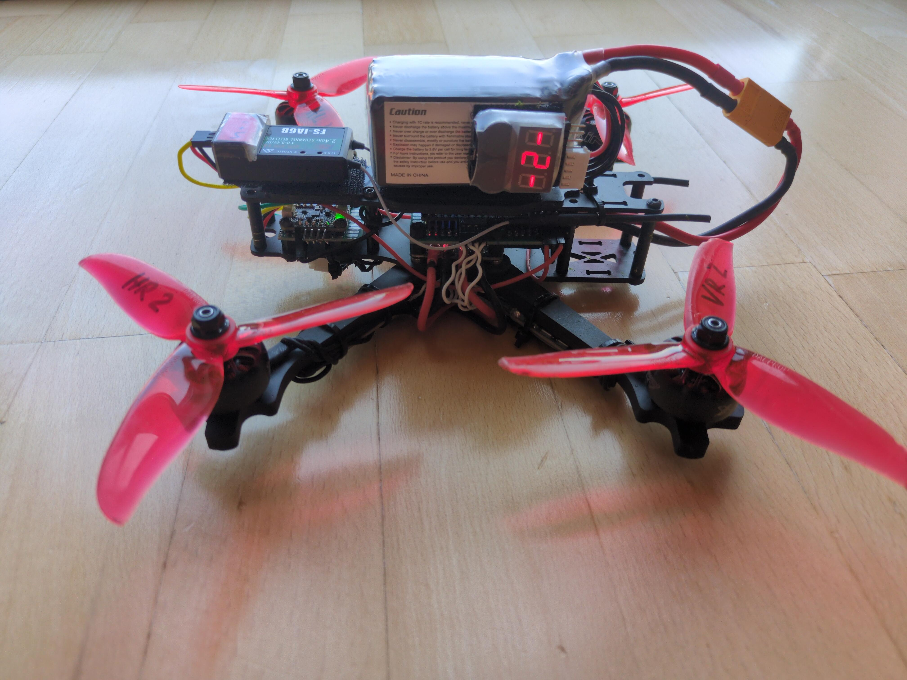
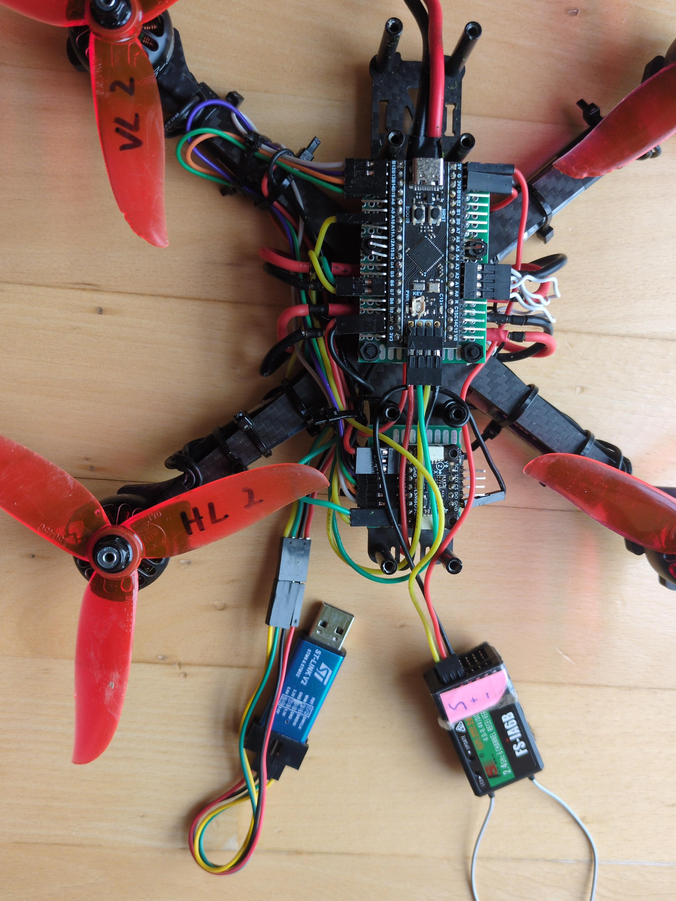

# DIY Quadcopter Flight Controller on STM32F411

A simple flight controller for a custom-built quadcopter, written in C using
[libopencm3](https://github.com/libopencm3/libopencm3) for the STM32F411CE MCU.

The project is still in a prototyping stage and is currently paused due to
hardware damage from a crash. A more detailed write-up and additional images and
videos will follow once replacement parts arrive.

## Demo and Hardware

Further images and videos could not be recorded due to the crash.

