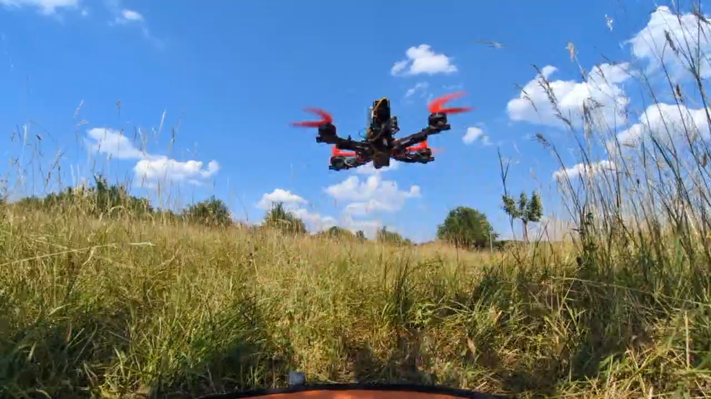
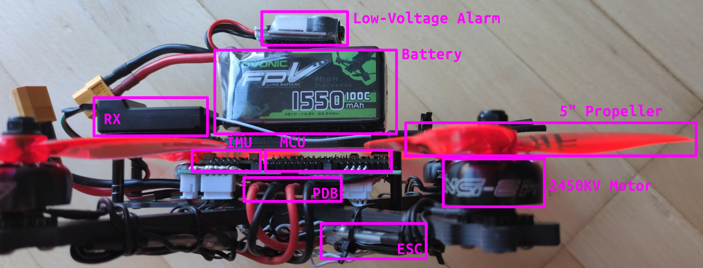
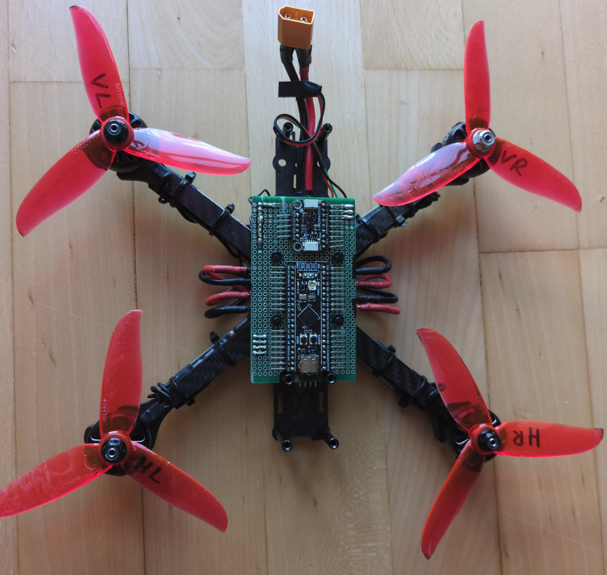
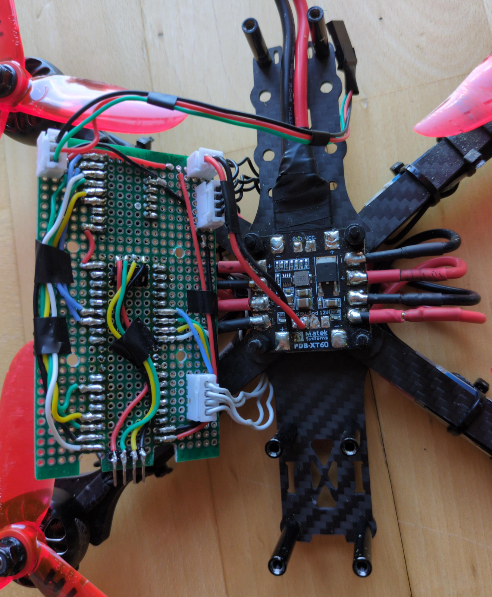

# DIY Quadcopter Flight Controller on STM32F411

A simple flight controller for a custom-built quadcopter, written in C using [libopencm3](https://github.com/libopencm3/libopencm3) for the STM32F411CE MCU. 

While the project is considered mostly "done" for now, I may continue to work on it in the future.

This README provides an overview of the project, while a more detailed writeup of individual project stages can be found in the `docs/` (**writeups currently in progress**):
1. [Quadcopter Basics and Hardware](docs/Stage_00-Drone_Basics_and_Hardware.md)
2. Blinky
3. USB Telemetry
4. Radio Receiver
5. Motor Control
6. Motor Mixing
7. IMU
8. PID

## Demo

## Project goal and scope

The project is intended to learn the basics of embedded software engineering and control theory, and to have fun with a custom-built drone. The goal is *not* to create a competitive, fully-featured flight controller such as Betaflight or Ardupilot.

The acceptance criterion for this project is a drone that can take off, hover in place, and fly stably for multiple minutes while responding predictably to roll, pitch, and yaw stick inputs under manual radio control.

The following subsystems are in scope:
- Communication: flight controller <-> radio receiver
    - Protocol: iBus
- Communication: flight controller <-> ESCs
    - Protocol: OneShot
- Communication: flight controller <-> IMU
    - Protocol: SPI and/or I2C
    - Roll/Pitch attitude is represented with Euler angles
- Motor mixing
- PID control
- Stablized flight mode
- Telemetry: while drone is on the ground, send data from drone over USB to PC and visualize it there

Explicitly out of scope:
- GPS and its applications, e.g.:
    - Autonomous flight along waypoints
    - Return-to-home on radio signal loss
- FPV camera feed
- Multiple flight modes
- Logging of telemetry data during flight
- "Fancy" control theory, e.g.:
    - Kalman Filter
    - Quaternions-based attitude representation
    - Sensors in addition to accelerometer and gyroscope
- Designing a PCB

## Architecture

This section briefly covers the hardware and software architecture. Details are outsourced to the respective project stage writeup in `docs/`.

### Hardware

- Form factor: 5-inch, X-shaped racing quadcopter
- Battery: 4S LIPO
- Motors: 2450 KV brushless DC
- ESC firmware: BLHeli_S
- Radio: FS-iA6B (RX), FS-i6 (TX)
- IMU: LSM6DSOX, containing:
    - 3-DOF accelerometer
    - 3-DOF gyroscope
- MCU: STM32F411CE (BlackPill v3.1 development board)
    - 512 KB Flash
    - 128 KB SRAM
    - max 100 MHz clock frequency
    - ARM Cortex-M4 CPU, ARMv7-M ISA

IMU and MCU are mounted on a perfboard, exposing header pins on the top:

Wires run on the bottom of the perfboard (a - **TODO**: slightly outdated, soon to be updated - wiring schematic can be found in `docs/hardware-wiring.pdf`). The PDB sits below the perfboard, separated by spacers:

**Note:** This is hardware version 2. Version 1 relied mostly on jumper wires and Dupont connectors. During a crash, the receiver wires were cut while the motors happily continued spinning at full throttle. Since I prefer my fingers attached, I decided that upgrading to soldered connections and adding an RX failsafe were worthwhile improvements.

### Software

#### Codebase layout

Flight controller code is written in C with [`libopencm3`](https://github.com/libopencm3/libopencm3) as a lightweight hardware library and [`newlib`](https://www.sourceware.org/newlib/) for C standard library functionality. No RTOS or anything like that is used. Codebase structure:
- `src/`: `*.c` files
- `include/`: `*.h` files
- `lib/`: 3rd-party libraries

Python scripts to visualize telemetry data are found in `scripts/`.

The project is built with the provided `Makefile`.

LSP support is added via `clangd` (`.clang-format`, `.clang-tidy`).

#### Main control loop

Code: `src/main.c`.

After initial setup of every component, the following control loop procedure repeats indefinitely every 2000 microseconds (i.e., at frequency of 500 Hz):
- the latest RX sample is read: the "desired" state
- the latest IMU sample is read: the "actual" state
- the roll, pitch, and yaw PID controllers are updated (based on the difference between "desired" and "actual" state of the respective axis)
- the desired base-throttle is combined with the PID corrections, and for each of the four motors we compute a new speed
- the current motor speeds are send to the ESCs every 1000 microseconds (i.e., at frequency of 1000 Hz)
- telemetry data is sent over USB, for debugging or logging
- we wait until the start of the next iteration

The system clock runs at 84 MHz, driven by a 25 MHz crystal on the BlackPill. The USB peripheral clocks at 48 MHz.

#### System timer

Code: `src/timer.c`, `include/timer.h`.
- Deprecated: `src/timer_busywait.c`

A 32-bit timer peripheral is used to implement a system-wide microsecond-precision timer (i.e., 1 tick per us). It overflows roughly every 71 minutes - way above the expected flight duration.

Short delays (<= 30us) are implemented through busy-waiting, while longer delays use the `WFI` (wait for interrupt) instruction of the ARM Cortex-M4.

#### Telemetry

Code:
- `src/telemetry/*.c`, `include/telemetry/*.h`
- `src/usb.c`, `include/usb.h`

Telemetry data includes:
- latest RX sample
- latest IMU sample
- estimated attitude (i.e., roll and pitch angles)
- static IMU bias
- output and internal state of roll, pitch, and yaw PID controllers
- computed motor speeds

Telemetry data is prefixed by a header containing:
- magic number (`0xDEADBEEF`), to indicate the packet start
- content ID: what type of data is this?
- content length in bytes
- a "sequence number", starting at 0 and incremented on each iteration of the main loop

It is send over the USB type-C connector of the BlackPill.

#### Radio

Code: `src/rx/*.c`, `include/rx/*.h`.

The RX uses the iBus protocol (based on UART) to send data of 14 radio channels to the flight controller, even though only 10 channels are used.

New values arrive roughly every 7.7ms.

Each channel value is a 2-byte integer ranging from 1000 to 2000, inclusive.

#### IMU

Code: `src/imu/*.c`, `include/imu/*.h`.

Static IMU bias is subtracted for each IMU measurement. The bias was determined through one-time calibration of the IMU.

The IMU is configured to output new accelerometer and gyroscope measurements at 1.67 kHz.

SPI is used to transfer data to the flight controller (I2C turned out to be too slow).

The flight controller is notified of new samples via two interrupt lines (one for gyroscope, one for accelerometer). However, data is not transferred until the main loop initiates a transfer - it misses a few samples but that's okay.

#### Attitude estimation

Code: `src/imu/attitude.c`, `include/attitude.h`.

The current roll and pitch angle of the drone is estimated through a combination of the accelerometer and gyroscope measurements. The sensor fusion algorithm is a complementary filter, chosen for simplicity.

#### PID controller

Code:
- `src/pid.c`, `include/pid.h`
- `src/fc.c`, `include/fc.h`

The actual PID implementation is generic in the sense that it doesn't know about flight-controller-related logic. That logic is wrapped in `src/fc.c`.

There's a separate PID controller for roll, pitch, and yaw axis. Currently, the roll and pitch PID share the same gains, while the yaw PID has different gains.

A wooden testrig was built to tune the roll and pitch PID gains through trial and error.

The current error only adds to the integral error if the motors are spinning at 20+% throttle, to not artificially increase it when moving the drone by hand or when the drone is not yet airborne (and, thus, cannot correct its error).

An anti-windup clamp to 10% of the current throttle is used to keep the integral error in bounds.

#### ESCs

Code: `src/esc/*.c`, `include/esc/*.h`.

Each ESC is connected with one signal wire to the flight controller.

The protocol to send motor speed values to the ESCs is OneShot42 - essentially PWM with a 42-84 microsecond duty cycle. The update period is set to 1ms. The reason for choosing OneShot42 over "better" alternatives such as DShot is a simpler implementation with sufficient performance.

#### Motor mixing

Code: `src/mm.c`, `include/mm.h`.

The desired base throttle is mixed with PID output to individual motor commands, based on my hardware layout of the drone (motor spinning direction, orientation).

## Helpful resources

On embedded software engineering:
- [Embedded Software Engineering 101](https://embedded.fm/blog/ese101)
- [An Introduction to Microcontrollers and Embedded Systems](https://www.eng.auburn.edu/~dbeale/MECH4240-50/Introduction%20to%20Microcontrollers%20and%20Embedded%20Systems.pdf)

On drones:
- [Oscar Liang](https://oscarliang.com/)
- [Electronic basics for new builders](https://www.youtube.com/playlist?list=PLYsWjANuAm4q82JUkfUwRQddkXEmqQN0X)
