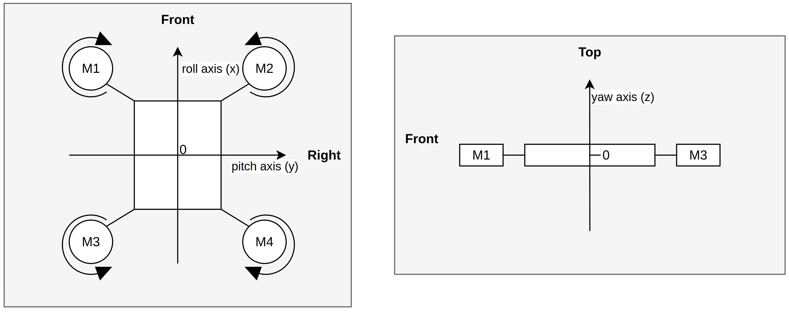

# Stage 00 - Drone Basics and Hardware

This stage establishes the background needed for everything that follows: how a quadcopter flies, and what hardware this build uses.

Contents:
- [Drone basics](#drone-basics)
    - [Drone components](#drone-components)
    - [Drone dynamics](#drone-dynamics)
- [This build](#this-build)
    - [Components](#components)
    - [Wiring](#wiring)

## Drone basics

It may be helpful to watch [Drone Theory 101 - Riley Morgan](https://www.youtube.com/watch?v=K05UwsiqZ_E).

A quadcopter is, mechanically, a simple idea: four motors spin four propellers fast enough to overcome gravity, and you steer by making some motors spin faster than others. The hard part is deciding *how* fast each motor should spin - that decision making is exactly what the flight controller (what is built in this project) is responsible for.

This section introduces the parts involved and basic flight dynamics.

### Drone components

- **Frame.** The skeleton everything else is mounted onto. Usually carbon fibre (light but durable). Frame size and shape mostly determine what size propellers/motors fit.
- **Motors + propellers.** Four DC motors, each with a propeller attached.
    - Motor datasheets list a KV value (e.g., 2450KV). It's the RPM per volt applied, measured with no propeller attached (no load). The higher that number, the faster the motor can spin.
- **ESCs (Electronic Speed Controllers).** One per motor. A motor can't be run directly off a "spin at 42% throttle" command. Instead, the ESC translates that command into the electrical signal that drives the motor.
- **Flight controller (FC).** A microcontroller that acts as the drone's "brain". It reads what the pilot wants (via the RX) and what the drone is actually doing (via the IMU), computes the difference, and outputs a correction as an ESC command for each motor. This loop (read, compare, correct) repeats many times per seconds and is called the *control loop*.
- **IMU (Inertial Measurement Unit).** A sensor package, typically a 3D gyroscope and 3D accelerometer (sometimes a 3D magnetometer too). Without it, the FC would have no idea if the drone is level, tilting, spinning, etc.
- **Radio receiver (RX) and transmitter (TX).** The pilot holds a TX. It sends commands over radio, several times per second, to the RX mounted on the drone. The RX decodes the radio signal into something the FC can read.
- **Battery.** Usually a *LiPo (Lithium Polymer)* pack because they pack a lot of energy for their weight. Important details:
    - **Cells and the "S" rating.** A LiPo pack is made of multiple cells stacked in series, each contributing roughly 3.5–4.2V depending on charge level. A "4S" battery has 4 cells, so a fully charged pack sits around 16.8V. The "S" number matters because motors and ESCs have to be rated to handle that voltage.
    - **Low-voltage alarm.** Unlike a lot of consumer batteries, draining a LiPo cell much below ~3.5V can permanently damage it. This is why the drone has a *low-voltage alarm* circuit attached, that beeps once the voltage drops below ~3.5V per cell (indicator to land the drone ASAP).
    - **Charging.** Two things you want from a charger:
        - *Balance charging*: charges each cell individually so they end up at the same voltage. No one cell should be over-/undercharged.
        - *Storage charging*: if you're not flying for a while, LiPos should be discharged down to a specific "storage" voltage (not full, not empty) before being put away.
    - **LiPo-safe bag.** Physically damaging a LiPo (puncturing it, or overcharging it) can cause it to swell or ignite - see [this](https://youtu.be/aZOKLpOn_W4). Charge/Store them in a fire-resistant *LiPo-safe bag*.
- **PDB (Power Distribution Board).** Takes the single battery voltage and distributes it: high-current lines to each of the 4 ESCs, plus a 5V line to power the low-current components (FC, IMU, RX). There's also a 12V line for FPV cameras; unused in this build.

### Drone dynamics

#### Piloting

The pilot doesn't say "motor 1: 1000 RPM, motor 2: 1500 RPM, ...". Commands are indirect and describe desired attitude, specifically:
- move up/down or hold altitude
- lean right/left
- lean forward/backward
- rotate counter-/clockwise as viewed from the above

This project implements *stabilize mode*: if the pilot gives no input, the drone should hold level and hover in place; if given an input, it should lean to match it. The FC's job is about closing the gap between "attitude the pilot asked for" and "attitude estimated via the IMU".

#### Flight axes

The following figure shows a model of the drone (left: top-view, right: side-view). There are three perpendicular axes, centered around the drone's center of gravity:
- *Roll*: lean left/right, i.e., rotate around x-axis
- *Pitch*: lean forward/backward, i.e., rotate around y-axis
- *Yaw*: rotate counter-/clockwise around the z-axis

Any maneuver is a baseline throttle (all motors at some common speed) plus a roll/pitch/yaw adjustment on top:
- Pitch: front motor pair (M1, M2) vs. back motor pair (M3, M4) spin at different speeds.
- Roll: left motor pair (M1, M3) vs. right motor pair (M2, M4) spin at different speeds.
- Yaw: diagonal motor pairs (M1, M4 vs. M2, M3) spin at different speeds (see torque, below).

#### Why yaw works: torque

Physics (Newton's third law) tells use that whenever a motor spins a propeller in one direction, the motor experiences an equal and opposite force - *torque*. Think of it as pushing away the motor (and, by extension, the frame) in order to accelerate the propeller in the other direction.

If all four propellers spun the same direction, this reaction torque would spin the entire frame around the z-axis. The fix: diagonally-opposite motor pairs spin in opposite directions (e.g. M1/M4 clockwise, M2/M3 counter-clockwise). At equal throttle, their reaction torques cancel and the frame stays put rotationally. Speed up one pair relative to the other, and the torque imbalance yaws the drone.

#### Sign convention

- Roll: leaning right is *positive* roll, leaning left is *negative* roll.
- Pitch: leaning forward is *positive* pitch, leaning backward is *negative* pitch.
- Yaw: looking at the drone from above, rotating clockwise is *positive* yaw, rotating counter-clockwise is *negative* yaw.

## This build

The hardware picked for this project, and briefly, why.

### Components

At a glance:

| Component | Choice                                         |
| --------- | ---------------------------------------------- |
| FC        | STM32F411CE on a WeAct BlackPill v3.1 devboard |
| IMU       | LSM6DSOX (accelerometer + gyroscope)           |
| TX        | FlySky FS-i6X                                  |
| RX        | FlySky FS-iA6B                                 |
| ESCs      | BLHeli_S                                       |
| Motors    | XING-E Pro2207, 2450KV                         |
| Battery   | 4S LiPo, 1550mAh, 100C                         |
| PDB       | Matek PDB-XT60                                 |

A parts list (excluding soldering iron, tin, wick) can be found [here](hardware-parts.pdf).

**Why these parts specifically:**
- Inspired by [OscarLiang's FPV shopping list](https://oscarliang.com/fpv-shopping-list/)
- STM32F411: off-the-shelf flight controllers are commonly STM32-based (see [this](https://oscarliang.com/flight-controller/#Processor)), and the F411 line offered enough performance while being available on cheap, well-documented devboards. The BlackPill was chosen over more beginner-friendly boards like the Nucleo-F411RE for its smaller footprint and because it requires only the minimal set of required features.
- LSM6DSOX: no strong technical reason beyond being cheap and performing well in [this IMU comparison](https://learn.adafruit.com/adafruit-sensorlab-gyroscope-calibration/comparing-gyroscopes).

**Documentation:**
- BlackPill
    - https://stm32-base.org/boards/STM32F411CEU6-WeAct-Black-Pill-V2.0.html
    - https://stm32-base.org/assets/pdf/boards/original-schematic-STM32F411CEU6_WeAct_Black_Pill_V2.0.pdf
    - https://stm32world.com/wiki/Black_Pill
- LSM6DSOX
    - [DS12814](https://www.st.com/resource/en/datasheet/lsm6dsox.pdf)
    - [AN5272](https://www.st.com/resource/en/application_note/an5272-lsm6dsox-alwayson-3axis-accelerometer-and-3axis-gyroscope-stmicroelectronics.pdf)
    - [Adafruit notes - LSM6DSOX, ISM330DHC, & LSM6DSO32 6 DoF IMUs](https://cdn-learn.adafruit.com/downloads/pdf/lsm6dsox-and-ism330dhc-6-dof-imu.pdf)
- STM32F411
    - [DS10314](https://www.st.com/resource/en/datasheet/stm32f411re.pdf)
    - [RM0383](https://www.st.com/resource/en/reference_manual/DM00119316-.pdf)
    - [AN4879](https://www.st.com/content/ccc/resource/technical/document/application_note/group0/0b/10/63/76/87/7a/47/4b/DM00296349/files/DM00296349.pdf/jcr:content/translations/en.DM00296349.pdf)
    - [ES0287](https://www.st.com/resource/en/errata_sheet/es0287-stm32f411xcxe-device-errata-stmicroelectronics.pdf)
    - [PM0214](https://www.st.com/content/ccc/resource/technical/document/programming_manual/6c/3a/cb/e7/e4/ea/44/9b/DM00046982.pdf/files/DM00046982.pdf/jcr:content/translations/en.DM00046982.pdf)
    - ARM docs:
        - [Arm Cortex-M Processor Comparison Table](https://developer.arm.com/-/media/Arm%20Developer%20Community/PDF/Cortex-A%20R%20M%20datasheets/Arm%20Cortex-M%20Comparison%20Table_v3.pdf)
        - [Arm Cortex-M4 Processor Datasheet](https://developer.arm.com/documentation/102832/latest/)
        - [ARMv7-M Architecture Reference Manual](https://developer.arm.com/documentation/ddi0403/ee/)
        - [Arm Debug Interface Architecture Specification](https://developer.arm.com/documentation/ihi0031/h/)
- ST-Linkv2
    - https://stm32-base.org/boards/Debugger-STM32F103C8U6-STLINKV2
- FlySky FS-i6X
    - https://www.flysky-cn.com/i6x-xiazai-1
- Matek PDB-XT60
    - https://www.mateksys.com/downloads/PDB-XT60_Manual_EN.pdf

### Wiring

The wiring diagram can be found [here](hardware-wiring.pdf).

Note:
- IMU<->FC is wired for SPI
- RX<->FC is wired for iBus

Wire gauges:
- Motor <-> ESC: 20 AWG
- ESC <-> PDB: 16 AWG
- PDB <-> Battery: 12 AWG
- PDB <-> FC: 24 AWG
- Elsewhere: 28 AWG

Connection types:
- PDB<->ESC power lines are connected via banana plugs.
- RX<->FC, ESC<->FC, and PDB<->FC wires are connected through JST connectors.
- All other connections are soldered.
- Pin headers are exposed for use by Dupont connectors.

