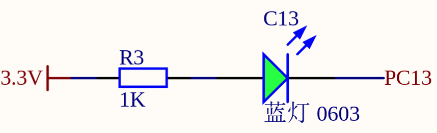
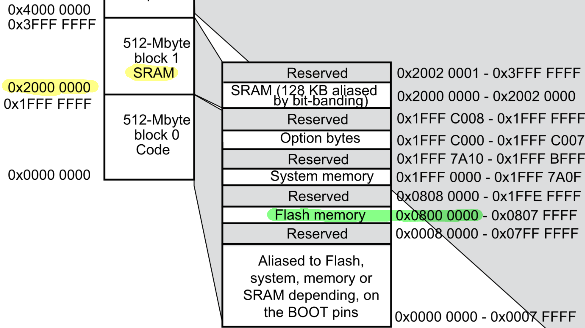
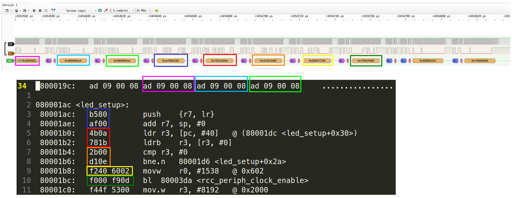

# Stage 01 - Blinky

In this stage we write a program that simply blinks the LED on the BlackPill board, to learn about the development workflow. The writeup also covers other details I found interesting.

The git branch of this project stage: `stage/01-blinky`.

Contents:
- [Setting up the toolchain](#setting-up-the-toolchain)
- [Implementing blinky](#implementing-blinky)
- [Flashing blinky](#flashing-blinky)
- [Debugging with GDB](#debugging-with-gdb)
- [Logic analyzer](#logic-analyzer)

---

## Setting up the toolchain

The high-level workflow:
1. Develop code in C on my Linux (Mint 22.1) laptop
2. Cross-compile the source code to an ARMv7-M binary
3. Load the binary into STM32's flash (via the ST-Linkv2)
4. Run the program on the STM32

This section briefly describes the toolchain.

### Libraries: `newlib` + `libopencm3`

The flight controller is written in C11.

#### C standard library

[newlib](https://sourceware.org/newlib/) provides C standard library functionality. It is designed for embedded systems as it does not assume an underlying operating system.

The `Makefile` expects newlib headers at `/usr/include/newlib`.

#### Firmware library

[`libopencm3`](https://github.com/libopencm3/libopencm3) is used as a lightweight firmware library. It provides thin wrappers around STM32 internals (e.g., macros for register addresses) but doesn't abstract away as many details as alternatives such as the HAL of the STM32CubeIDE. I chose it to be exposed to details without getting overwhelmed as a newcomer in the embedded field.

[libopencm3-examples](https://github.com/libopencm3/libopencm3-examples) provides helpful usage examples.

`libopencm3` is added as a [Git submodule](https://git-scm.com/book/en/v2/Git-Tools-Submodules). To build it, run:
```bash
make -C lib/libopencm3
```

To pull updates, run:
```bash
git submodule update --remote lib/libopencm3
```

### Neovim LSP

This section briefly covers LSP support for Neovim 0.12 for the project.

Install [`clangd`](https://clangd.llvm.org/) (language server), [`clang-format`](https://clang.llvm.org/docs/ClangFormat.html) (formatter), and [`clang-tidy`](https://clang.llvm.org/extra/clang-tidy/) (linter):
```bash
apt install clang-tidy

# within Neovim, run:
:MasonInstall clangd

# verify:
$ which clangd clang-format clang-tidy
/home/jonathan/.local/share/nvim/mason/bin/clangd
/home/jonathan/.local/share/nvim/mason/bin/clang-format
/usr/bin/clang-tidy
```

`.clang-format` and `.clang-tidy` configure the respective tools.

Use [`Bear`](https://github.com/rizsotto/Bear) to generate a `compile_commands.json` from the `Makefile`, such that `clangd` uses the same compiler options as the `Makefile`. Since `compile_commands.json` is per-file, it must be regenerated when the file tree changes.
```bash
apt install bear
make lsp # produce compile_commands.json with bear
```

### Cross-compiler

Source code is cross-compiled to ARMv7-M machine code, to be run by the ARM Cortex-M4 CPU inside the STM32F411.

This is done via the [ARM GNU Toolchain](https://developer.arm.com/downloads/-/arm-gnu-toolchain-downloads). To install, run:
```bash
apt install gcc-arm-none-eabi
```

The name `gcc-arm-none-eabi` follows the naming convention `<arch>-<vendor>-<os>-<abi>`.

The toolchain provides several useful binaries:

| Binary                  | Purpose                               |
| ----------------------- | ------------------------------------- |
| `arm-none-eabi-gcc`     | C compiler                            |
| `arm-none-eabi-ld`      | Linker                                |
| `arm-none-eabi-objdump` | Disassembler                          |
| `arm-none-eabi-objcopy` | Extracting the raw binary from an ELF |

### ST-Linkv2 programmer

Programs are loaded into the flash memory of the STM32 via the [*Serial Wire Debug (SWD)*](https://developer.arm.com/documentation/ihi0031/a/The-Serial-Wire-Debug-Port--SW-DP-/Introduction-to-the-ARM-Serial-Wire-Debug--SWD--protocol) protocol, by connecting the BlackPill's SWD pins to an ST-Linkv2 programmer.

To control the ST-Linkv2, we use [`stlink`](https://github.com/stlink-org/stlink/releases):
```bash
apt install stlink
st-info --version # v1.8.0
```

Connect the ST-Linkv2's `SWCLK`, `SWDIO`, `GND`, `3.3V` pin to the BlackPill's `SCK`, `DIO`, `GND`, `3V3` SWD pin, respectively.
Then, verify that we are indeed talking to an STM32F411:
```bash
$ lsusb
Bus 001 Device 014: ID 0483:3748 STMicroelectronics ST-LINK/V2

$ st-info --probe
Found 1 stlink programmers
  version:    V2J29S7
  serial:     16004A002933353739303541
  flash:      524288 (pagesize: 16384)
  sram:       131072
  chipid:     0x431
  dev-type:   STM32F411xC_xE
```

### Building the project

The build system is a `Makefile` adapted from the [libopencm3-template](https://github.com/libopencm3/libopencm3-template). It contains targets that wrap the abovementioned tools.

Usage:
- `make`: builds the project. Generates:
    - ELF and plain binary: `src/bin/`
    - Linker script: `src/generated.stm32f411ceu6.ld`
- `make flash`: loads `src/bin/*.bin` into STM32's flash memory
- `make lsp`: regenerates `compile_commands.json` with `bear`
- `make debug`: starts GDB over SWD, for debugging
- `make clean`: removes `src/bin/` and generated linker script

You may want to adjust the compiler `OPT`imization level:
- `-O0`: little optimization (for debugging)
- `-Os`: heavy optimization (as small as possible)

---

## Implementing blinky

Given the overview of the toolchain, this section briefly goes over the code that implements blinky. For more details, read the actual code.

To blink an LED, we toggle its state (ON or OFF) at a certain time interval. Two modules:
- LED module
- Timer module to implement a delay

The control flow is simple:
```c
int main(void)
{
    led_setup();
    timer_setup();

    while (1) {
        led_toggle();
        timer_wait_us(1000000); /* delay for 1 second */
    }
}
```

We have to figure out two things:
- How to toggle the LED?
- How to implement a delay?

### Toggling the LED

The LED is connected to a GPIO (general-purpose I/O) pin, specifically pin C13, as shown in the BlackPill schematic:


GPIO pins are grouped into *ports* (A, B, ...) and each port contains multiple *pins* (1, 2, ...). Pin C13 refers to GPIO port C pin 13.

Some terminology and notes:
- The *general-purpose* in GPIO means that these pins can be used for anything really. They don't (need to) have a special function. For example, some pins are only there to supply power or are hard-wired for debugging I/O. GPIO pins, however, can be programmed "to our will", for example, to make an LED blink by applying a non-zero voltage at certain points in time.
- GPIO is a *peripheral* - esentially a device or interface that communicates with the outside world.
- On ARMv7-M, which underlies the STM32F411, peripherals are accessed through memory (= *memory-mapped I/O*). The idea is that each peripheral has a few registers, like control registers (control behavior of peripheral), status registers (status flags of peripheral), data registers (to read/write data). Writing to / Reading from these registers is how our program interacts with the GPIO hardware.
- There is no virtual memory - all addresses are physical addresses.

Instead of reading/writing the GPIO registers directly, we use wrappers provided by `libopencm3`, like `gpio_toggle()`. This spares us from having to dig through the STM32 reference manual to figure out which addresses map to which registers and which bits to flip for a given outcome.

To toggle the pin C13 and, by extension the LED, we first have to "activate" GPIO port C. By default, the GPIO peripheral is disabled in the sense that it does not receive a clock signal; this is done to save power. The *Reset & Clock Control (RCC)* module is used to enable GPIO port C:
```c
rcc_periph_clock_enable(RCC_GPIOC);
```

Then, we configure pin C13 as an output pin:
```c
gpio_mode_setup(GPIOC, GPIO_MODE_OUTPUT, GPIO_PUPD_NONE, GPIO13);
```

After this setup, we can toggle the LED:
```c
gpio_toggle(GPIOC, GPIO13);
```

See `src/led.c`.

### Implementing a delay

There are multiple ways to delay program execution.

#### Timer: NOPs

Execute no-operations (NOPs), where the CPU does nothing:
```c
void delay_nop(uint32_t n)
{
    for (uint32_t i = 0; i < n; i++)
        __asm__ volatile("nop");
}
```

This works but it's hard to control the exact timing with this method, especially if we later change the clock speed.

#### Timer: busy-wait

The better way is to use a *hardware timer peripheral*. A timer contains a counter that increments at a configurable rate (on overflow, an *update event (UEV)* is generated).

The STM32F411 has multiple timers that differ slightly in their features and counter-width. Here, we use the general-purpose timer `TIM2` that has a 32-bit-wide counter. We configure it to increment once every microsecond.

As with GPIO, the timer peripheral is disabled by default and must be enabled via RCC:
```c
rcc_periph_clock_enable(TIM2);
```

Then we configure the timer:
```c
timer_set_mode(TIM2, TIM_CR1_CKD_CK_INT, TIM_CR1_CMS_EDGE, TIM_CR1_DIR_UP);
timer_set_prescaler(TIM2, (rcc_get_timer_clk_freq(TIM2) / 1e6) - 1);
timer_set_period(TIM2, 0xffffffff);
timer_set_counter(TIM2, 0);
TIM_EGR(TIM2) = TIM_EGR_UG;
timer_enable_counter(TIM2);
```
- `timer_set_mode`: configures the timer's behavior
    - `TIM_CR1_CKD_CK_INT`: use internal clock as the source
    - `TIM_CR1_CMS_EDGE`: count on clock signal's edge
    - `TIM_CR1_DIR_UP`: count upward
- `timer_set_prescaler`: divides the input clock by the right divisor so the counter increments once per microsecond, regardless of the configured clock frequency
- `timer_set_period`: sets the auto-reload register - the value at which the counter wraps back to zero. `0xffffffff` is the maximum 32-bit value, giving a wrap period of ~71 minutes at 1 tick/us.
- `timer_set_counter`: explicitely initializes counter to 0
- `TIM_EGR_UG`: generate an UEV to *immediately* apply timer config
- `timer_enable_counter`: starts the counter

Delaying is then simply:
```c
void timer_wait_us(uint32_t us)
{
    uint32_t start = timer_get_counter(TIM2);
    while (timer_get_counter(TIM2) - start < us);
}
```

See `src/timer_busywait.c`.

#### Timer: wait for interrupt (WFI)

A more power-efficient way to implement a delay using a timer is to use the `WFI` (wait for interrupt) instruction.

From the ARMv7-M specification:
> Wait For Interrupt is a hint instruction. It suspends execution, in the lowest power state available consistent with a fast wakeup without the need for software restoration, until a reset, asynchronous exception or other event occurs.

Going to sleep and subsequently waking up probably takes some time and resources (I didn't check tbh). Thus, we use `WFI` for delays above a threshold (e.g., above 30us) and busy-wait for shorter delays.

To wake up at the end of the delay, the `TIM_OC1` value is set to `now + delay` and we fire an interrupt once that value is reached. This interrupt wakes us after going to sleep via `WFI`. Unrelated interrupts may wake us prematurely, so we have to check after wake up if the delay is truly over or if we have to delay further.

See `src/timer.c`.

---

## Flashing blinky

Load the binary onto the STM32:
1. `make`
2. `make flash`
The LED should blink each second.

The remainder of this section goes into details of the flash and boot process that I found interesting.

### STM32 memory: flash vs SRAM

Helpful read: https://embedded.fm/blog/2016/5/9/ese101-memory

The STM32F411CE has two main types of memory:

| Type  | Start address | Size   | Volatile? | PC equivalent      |
| ----- | ------------- | ------ | --------- | ------------------ |
| Flash | `0x08000000`  | 512 KB | No        | Disk (SSD / HDD)   |
| SRAM  | `0x20000000`  | 128 KB | Yes       | Main memory (DRAM) |

Flash:
- Persists after power-off.
- It's where programs are stored.
- Flash has to be erased before being written. You can only rewrite chunks of flash (see RM0383 Table 2). This takes some time and after a large number of rewrites the memory wears out. These are reasons that make it not a suitable target for frequent read/write at runtime.

SRAM:
- Doesn't persist after power-off but provides fast read/write without wearing out. Thus, it serves as main memory during runtime.

The memory map (RM0383 Chapter 5) shows which addresses are mapped to flash and SRAM:


### The linker script

After compilation, the linker needs to decide where to place each part of the binary in memory. This is defined in the linker script that's auto-generated by `libopencm3` (`src/generated.stm32f411ceu6.ld`).

```
MEMORY
{
 ram (rwx) : ORIGIN = 0x20000000, LENGTH = 128K
 rom (rx) : ORIGIN = 0x08000000, LENGTH = 512K
}
```
- `ram` defined as 128KB starting at `0x2000 0000` => SRAM
    - read/write/execute
- `rom` defined as 512KB starting at `0x0800 0000` => Flash
    - only read/execute

```
 .text : {
  *(.vectors)
  *(.text*)
  . = ALIGN(4);
  *(.rodata*)
  . = ALIGN(4);
 } >rom
```
- places at the start of flash, i.e., at `0x8000 0000`:
    - `.vectors`: the interrupt vector table
    - `.text`: the program code
    - `.rodata`: read-only data (strings, etc.)

```
 .data : {
  _data = .;
  *(.data*)
  *(.ramtext*)
  . = ALIGN(4);
  _edata = .;
 } >ram AT >rom
 _data_loadaddr = LOADADDR(.data);
```
- `.data`: initialized global variables
- `>ram AT >rom`
    - The initial values of these variables must persist across power-cycles, i.e., must be stored in flash. But since they must be writable and flash is rx-only, they must be copied into SRAM as well.
    - This expression says: copy this section from flash into SRAM, then use SRAM during program execution.
- The reset handler would therefore do sth like:
```c
memcpy(_data, _data_loadaddr, _edata - _data);
```

```
 .bss : {
  *(.bss*)
  *(COMMON)
  . = ALIGN(4);
  _ebss = .;
 } >ram
```
- `.bss`: uninitialized global variables, or zero-initialized `static` variables
- reset handler zero-initializes this memory section, like:
```c
memset(_bss_start, 0, _ebss - _bss_start);
```

```
PROVIDE(_stack = ORIGIN(ram) + LENGTH(ram));
```
- The stack start is initialized to the very top of the SRAM (and it grows downward).

So, we end up with the classic memory layout, except that there's no heap between `.bss` and the stack here:
```
+-----------------+
|      Stack      |
|        |        |
|        v        |
|                 |
+-----------------+
|      .bss       |
+-----------------+
|      .data      |
+-----------------+
|      .text      |
+-----------------+  <- SRAM start
```

### Disassembling the binary

Compilation produces an ELF (`src/bin/blinky.elf`). From this, `arm-none-eabi-objcopy` strips everything except the raw machine code and produces a flat `src/bin/blinky.bin` that is then loaded into STM32's flash.

Lets disassemble the ELF to inspect what ended up where:
```bash
arm-none-eabi-objdump -d src/blinky.elf
```

#### The interrupt vector table

It starts with the *interrupt vector table*, at `0x08000000`.

```
08000000 <vector_table>:
 8000000:	00 00 02 20 b1 09 00 08 af 09 00 08 ad 09 00 08     ... ............
 8000010:	ad 09 00 08 ad 09 00 08 ad 09 00 08 00 00 00 00     ................
	...
```

An *interrupt* is a type of exception. Software can throw interrupts, as well as hardware. Whenever an interrupt is generated, it is handled by a function known as the *interrupt service routine (ISR)* before continuing where left off.

The interrupt vector table simply stores the mappings from interrupt identifiers to the address of the respective ISR.

I will come back to the values in the interrupt vector table.

#### Our code

Then comes our code:
```
080001ac <led_setup>:
    ...
080001e4 <led_toggle>:
    ...
080001fc <main>:
    ...
...
```

#### Interrupt handlers

At the end we find different interrupt handlers.

##### Blocking/Null handler
```
080009ac <blocking_handler>:
 80009ac:	e7fe      	b.n	80009ac <blocking_handler>
```
- Infinite loop.
- Default ISR for interrupts that cannot be ignored.

```
080009ae <null_handler>:
 80009ae:	4770      	bx	lr
```
- Returns to caller.
- Default ISR for interrupts that can be ignored.

Looking at the interrupt vector table from above, we see the addresses of `<blocking_handler>` and `<null_handler>` but one-off:
- `ad 09 00 08` = 0x080009ac + 1
- `af 09 00 08` = 0x080009ae + 1

The reason for the one-off is that we are in *ARM Thumb mode*, which is indicated by addresses having the LSB set. The idea of Thumb mode is to have 16-bit aliases for the usual 32-bit instruction opcodes, whenever possible. While this shrinks the number of available instructions, it also shrinks the program size which is often the more limiting factor for embedded systems.

Actually, this is *Thumb-2*. It uses 2-byte instructions where possible but allows 4-byte instructions. We see this, for example, here:
```
 80009c2:	d321      	bcc.n	8000a08 <reset_handler+0x58>
 80009c4:	f04f 23e0 	mov.w	r3, #3758153728	@ 0xe000e000
```

##### Reset handler

The `<reset_handler>` contains a few interesting parts that were partly discussed earlier:
- it copies `.data` from flash to SRAM
- it zero-initializes `.bss`

Then it jumps to `main()` and our blinky starts executing.

### Boot process

The STM32F411 supports multiple boot modes (RM0383 Table 2), selected by the `BOOT0` pin. The BlackPill defaults to boot from Flash, which maps the Flash memory to address `0x00000000`. Effectively, `0x00000000` is aliased to `0x08000000` during boot.

As seen, the first thing in flash is the interrupt vector table. ARM mandates that this table begins at `0x00000000`. The CPU reads two entries from it immediately on boot:
1. Word 0 (`0x20020000`): loaded into the stack pointer. This sets up the initial top of the stack. `0x20020000` = `0x20000000` (start of SRAM) + 128 KB. That is, the very top of SRAM, since the stack grows downward.
2. Word 1 (`0x080009b1`): the address of the *reset handler* + 1. The CPU jumps here and begins execution.

---

## Debugging with GDB

I found that debugging with a logic analyzer or printf-style debugging via telemetry, is often more convenient. But there are times when you have to fire up a debugger, for example, when the program gets stuck in a while-loop and we have to inspect register contents to figure out the problem. 

Make sure to disable compiler optimizations in the `Makefile` so that the generated binary closely matches the source code and symbols are reserved, making it easier to inspect.

Install `gdb-multiarch`:
```bash
apt install gdb-multiarch
```

Connect the ST-Linkv2 to the PC.

Start the GDB server (by default it runs on `localhost:4242`):
```bash
make debug
```
The server will translate between GDB commands and SWD.

Then connect the GDB client to the server:
```bash
gdb-multiarch src/bin/blinky.elf
(gdb) target extended-remote localhost:4242
(gdb) load # load blinky into memory
(gdb) c # start blinky
```

Assuming we want to see why we get stuck somewhere, we can proceed as follows:
- Let the program run until it gets stuck (e.g., a heartbeat LED stops blinking), then hit `Ctrl`+`c` in the GDB terminal to halt execution.
- `(gdb) bt` to get the backtrace
    - `(gdb) frame <n>` to goto a listed stack frame (to print that frame's local vars etc.)
- `(gdb) list` to list lines surrounding error location
- `(gdb) print/x <var>` to print some variable, e.g., peripheral register
- `(gdb) info registers` to dump CPU registers

---

## Logic analyzer

A *logic analyzer* is used to debug a digital signal. It is similar to an oscilloscope but often cheaper, plus logic analyzer software can decode well-known protocols. It samples a signal at a specified rate. Note that the sampling rate has to be at least as fast as the signal you investigate, otherwise data points are missed. Cheap logic analyzers often cannot sample at very high frequencies, but are sufficient for most protocols.

It's basically there to see "what's going on on a wire". Like Wireshark, but for the embedded world.

The following briefly covers how to use a logic analyzer to monitor our blinky binary while being flashed onto the STM32.

### Wiring

Connect the analyzer to the SWD lines between the ST-Linkv2 and the BlackPill:
- Channel 1 -> SWD clock pin
- Channel 2 -> SWD data pin
- GND -> GND pin

### Recording in PulseView

On Linux, install [sigrok](http://sigrok.org/) and its GUI [PulseView](https://sigrok.org/wiki/PulseView) for analysis:
```bash
apt install sigrok pulseview
```

1. Open PulseView -> *Connect to Device* -> driver `fx2lafw` -> *Scan for device*
2. Set sampling rate to, say, 24 MHz (high enough to not miss samples)
3. *Add protocol decoder*: *SWD*, assign clock and I/O channels
4. Hit *Run*, then immediately run `make flash` in the terminal
5. Stop the recording once flashing completes

### Seeing the binary on the wire

There's quite a lot of "traffic" but if you zoom in you'll find the binary contents being written (the editor screenshot shows part of the `src/bin/blinky.elf`):


I suppose that the 8 bytes after the dark-green bytes in the screenshot are probably SWD internals.
